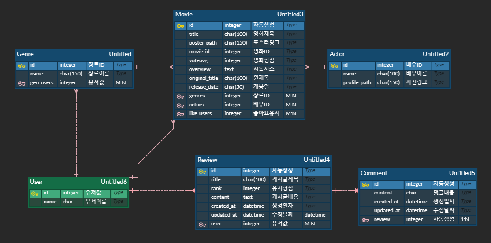

# MORE 

- 목적 : 영화 추천 사이트
- 개발 기간 : 20.06.11 ~ 20.06.18 (7일)
- [베포링크](http://13.125.197.31/)

---

---

### 개발 프로그램

---

#### 차례

​	[1. 팀 구성원 및 업무 분장](#팀-구성원-및-업무-분장)

​	[2. DB 모델링](#db-모델링) 

​	[3. 핵심기능](#핵심기능)

​	[4. 느낀점](#느낀점)

---

## 팀 구성원 및 업무 분장

#### 허성수

  - 팀장
    - DB 모델링 및 최적화
    - JSON 가공을 통한 데이터 처리
    - 추천 알고리즘 및 검색기능 포함 전반적인 기능 구현

#### 강창현

- 팀원
  - 게시판 등 기초적인 틀 구현
  - UI / UX 향상을 위한 CSS 구현
  - 5분 가량의 UCC 동영상 / PPT 제작 및 발표

---

## DB 모델링

---

## 핵심기능

> **사용자와 연결된 장르를 통해서 필터링 하여 추천 알고리즘 구성**
>
> 사용자가 장르를 고르지 않았다면 랜덤 10선을 보여줌
>
> 쿼리를 이용해 영화, 영화배우, 장르 유동적으로 검색 가능 하며 페이지도 별도 구성
>
> 리뷰를 통한 유저 평점 별도 구성
>
> css 에니메이션을 사용하여 시각적 효과 사용

#### 구현기능

관리자인 경우 영화 등록 / 수정 / 삭제

유저 회원가입 / 로그인 / 로그아웃

TMDB API를 사용한 영화데이터 크롤링

영화 추천 기능

영화 제목 / 장르 / 영화배우 검색 기능

게시글 생성 / 수정 / 삭제 / 평점 부여

댓글 생성 / 삭제

pagination 을 통한 페이지 구현

---

## 느낀점

스스로 있었으면 하는걸 구현해서 붙이다 보니 업무 분장에 상당한 애로사항이 있었음

머지하는데 굉장히 오랜 시간 소모

N:M 구현하는 것이 생각보다 어려웠음 - 공식문서를 통해 해결함(직접 add 명령어로 추가함)

데이터를 넣다가 서버 지연으로 인해서 오류가 나면 영화 데이터가 두개씩 들어가서 많이 고생함

쿼리 구성하는게 생각보다 어려웠음 특히 검색기능 구현할때 쿼리를 그대로 넘기면 되는줄 알았으나 실제로 작동하지 않아서 하나하나 오브젝트화 시켜서 필요한 데이터를 넘겨주는 작업 진행

이 부분은 하드코딩을 통해서 어느정도 구현이 가능할 것으로 보임

사실상 5개월 동안 배운 것들을 총 집합 하는 것이어서 내가 어느정도 위치에 있는지 확실하게 알게 되었음

vsCode로 작성하는데 디버깅이 불분명한 것이 많아서 그부분은 좀 아쉬웠음

일주일 동안 굉장히 많은 시간을 투자했는데 시간 가는줄 모르고 정말 재밌게 해서 스스로 만족함

---

